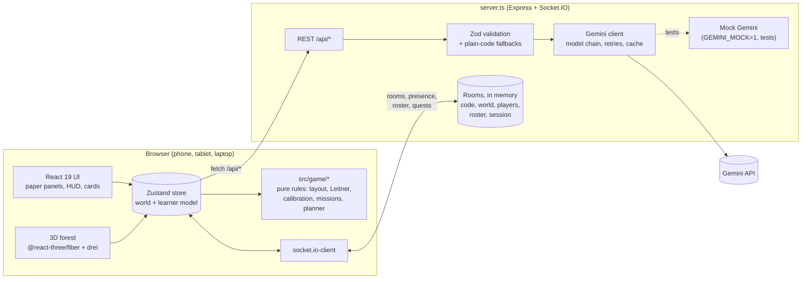
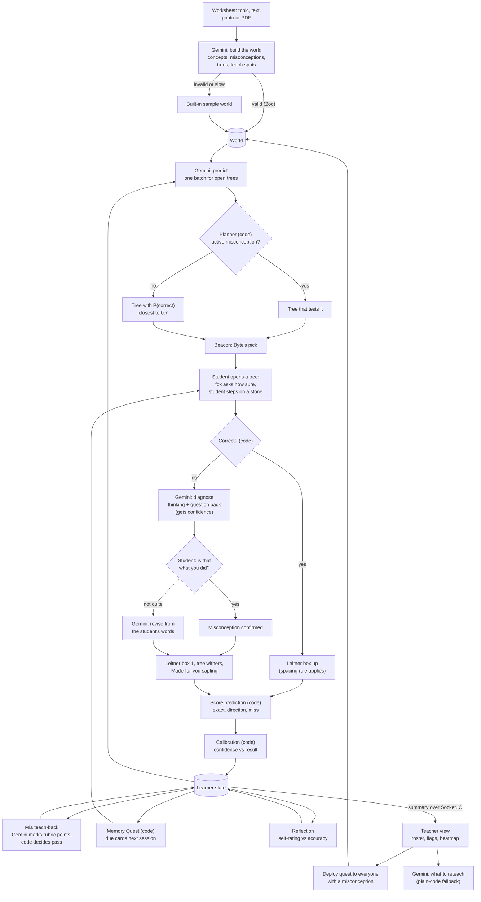

# Mastery Grove v2: architecture

Tech choices confirmed by Afshal on 27 Sep 2026: Socket.IO for multiplayer, Vitest and Playwright (TypeScript) for tests, responsive web (phone first), and a storybook look.

## What it is

A teacher's worksheet becomes a 3D forest. Each question is a tree, and each concept is a grove. Gemini keeps a model of each student:
- It predicts their next answer and the mistake behind it.
- When they get something wrong, it guesses how they were thinking and asks them whether that's right.

Plain code does the rest. It checks answers, scores every prediction, schedules reviews and opens new groves.

The rule we hold to: **Gemini generates, predicts and diagnoses. Code decides and measures.** Gemini never grades itself.

## Where it runs

- **GitHub** ([AfshalG/mastery-grove](https://github.com/AfshalG/mastery-grove)) holds the source. Work moves from a feature branch to `development`, and only tested milestones go on to `main`.
- **Google AI Studio** hosts it. The AI Studio app links to this repo, pulls `main`, and Publish deploys it to Cloud Run at mastery-grove.ai.studio. The hackathon build is kept as the tag `v1.0-hackathon`.

To stay compatible with AI Studio:
- `server.ts` stays the entry point (`tsx server.ts`), and the npm script names don't change.
- The port comes from `PORT`. `GEMINI_API_KEY` comes from AI Studio's Secrets panel or a local `.env`, and is never committed.
- No native modules. `bun.lock` is kept in sync because AI Studio installs with Bun.
- Tests, test configs and fixtures are dev-only. The app never imports them.

## System



## The learner-model loop



**Decision points, all in code:**
- whether the answer is correct
- whether the prediction hit
- which tree the planner picks
- a card's Leitner box and when it's due
- whether a grove is open
- whether Mia's rubric was met
- whether a student counts as overconfident

## State schema

```ts
// World (from Gemini or the sample)
interface Concept       { id: string; name: string; questName: string; prerequisites: string[] }
interface Misconception { id: string; conceptId: string; label: string }
interface TeachSpot     { conceptId: string; misconceptionId?: string; puzzledThought: string; board?: string; rubricPoints: string[] } // new in v2
interface Tree {
  id: string; conceptId: string; question: string; choices: string[]; answerIndex: number;
  explanation: string; citation: { page: number; quote: string } | null;
  visual?: FractionVisual;          // cake, two cakes, bar
  kind?: 'mcq' | 'recall' | 'serve';
  origin: 'base' | 'made-for-you' | 'teacher' | 'memory';   // replaces the isX flags
  sourceTreeId?: string; targetMisconceptionId?: string;
}
interface World { subject: string; skin: 'maths' | 'reading'; concepts: Concept[];
                  misconceptions: Misconception[]; trees: Tree[]; teachSpots: TeachSpot[] }

// Where things stand in the forest. Computed by src/game/layout.ts, never by Gemini
interface Layout { groves: { conceptId: string; centre: Vec2; radius: number; sign: Vec2; bridge?: Vec2 }[];
                   trees: Record<string, Vec2>; path: Vec2[]; bounds: { minX: number; maxX: number; minZ: number; maxZ: number } }

// Learner state (one per student per world, saved in localStorage)
interface Card { box: 1 | 2 | 3; lastSession: number; lastTurn: number; lapses: number; missedAtTurn: number | null }
type Confidence = 'Not sure' | 'Fairly sure' | 'Very sure';
interface Attempt {
  treeId: string; choiceIndex: number; correct: boolean; confidence: Confidence;
  misconceptionId: string | null; thoughtProcess: string | null; hint: string | null;
  prediction: Prediction | null; predictionHit: 'exact' | 'direction' | 'miss' | null;
  turn: number; session: number; at: number;
}
interface LearnerState {
  studentId: string; name: string; session: number; turn: number;
  attempts: Attempt[];
  cards: Record<string, Card>;                       // Leitner, one per tree
  misconceptionStrength: Record<string, number>;     // 0..1
  activeMisconceptionId: string | null;
  confirmedThoughts: ThoughtProcessRecord[];         // what the student said yes to
  predictionStats: { exact: number; direction: number; miss: number };
  calibration: { calibrated: number; overconfident: number; underconfident: number };
  reflections: { conceptId: string; rating: 1 | 2 | 3 | 4; note: string; accuracy: number }[];
  teachBacks: { conceptId: string; passed: boolean; hit: string[]; missing: string[]; words: string; spoken: boolean; session: number; at: number }[];
  xp: number;
}

// Room (server memory)
interface Room {
  code: string;                   // 4 characters from CDFGHJKMNPQRTVWX3469
  world: World; session: number; createdAt: number; lastActiveAt: number;
  players: Map<string, { id: string; name: string; role: 'student' | 'teacher' | 'sample';
                         x: number; z: number; yaw: number; moving: boolean; summary?: LearnerSummary }>;
}
```

## Rules in code (all unit-tested)

| Rule | Definition |
|---|---|
| Correct | `choiceIndex === answerIndex`. Recall answers are normalised first: case, spaces, and numbers or fractions compared as values. |
| Prediction score | exact if `predictedChoice` matched. direction if `pCorrect >= 0.5` matched whether the student was right. miss otherwise. |
| Planner | Memory checks first, then made-for-you trees. With no predictions yet, the first open tree. If a misconception is active, the open tree Byte predicts will show it, with P(correct) closest to 0.6. Otherwise the open tree with P(correct) closest to 0.7. |
| Leitner | New cards start in box 1. First correct answer: box 2 (learned). A correct answer in a later session: box 3 (mastered). Wrong: box 1. |
| Spacing | Fixing a missed tree only counts if at least one other question came between the miss and the fix. |
| Due (Memory Quest) | When the teacher starts the next session, or the kid comes back on a new day: box 2 trees last seen at least 1 session ago, box 3 trees at least 3 sessions ago. Missed trees come back through their saplings instead. A due tree hides its choices until the kid has an answer in mind. |
| Grove health | Share of a grove's worksheet trees answered right. Saplings and made-for-you trees don't count. |
| Unlock | A grove opens when every prerequisite grove has health of at least 0.6. Once open, it stays open: a memory check answered wrong wilts a tree but never locks a grove (or breaks a bridge) the kid has reached. |
| Bridges | A stream runs between each pair of groves. Its bridge's planks are laid as the groves before it grow (each counts up to its 60%, and the least-grown sets the pace). It opens when the grove past it, or any later one, opens. Water blocks the kid everywhere else, and a click past an unfinished bridge walks only to its near end. |
| Missions | For the first open grove that isn't done: grow 60% of its trees (builds the bridge), explain it to Mia, cross to the next grove, and (optional) grow the rest. Memory checks come first. Byte's beam points at the first mission still to do: a tree (Byte's pick when it's in this grove), Mia, or the way into the next grove. |
| Saplings | At most 2 Made-for-you trees per missed tree per session. |
| Hands-on challenges | Serve a fraction of a cake, or lay a fraction of a bridge's planks, by tapping the 3D model over the tree or the card. A wrong serve names the exact mistake: the top number, the bottom number, the part that should stay behind, the whole thing, nothing, or too few or too many (with the fraction it came to, e.g. "6/12 = 1/2"). The top- and bottom-number mistakes count toward the matching misconception. |
| Calibration | One line after every answer compares confidence with the result. Very sure and wrong: "that's the moment to slow down and check". Not sure and right: "you knew more than you thought". |
| Reflection feedback | Rating 3+ with accuracy below 70%: "You felt sure, but got X% right." Rating 2 or less with accuracy 70%+: "You know more than you think." |
| Mia asks for help | Once her grove's health reaches 0.6 (the same point the next grove opens): explaining comes after practising. Before that she says how many more trees to grow. Once helped, she stays helped. |
| Mia passes | Gemini marks which rubric points the explanation covered (and transcribes a voice note). Code passes it at two thirds of the points or more. A pass weakens the misconception Mia had in the kid's own model. |
| Offline marking | Without Gemini, a typed explanation is marked by shared words: a point counts when the kid used at least half of its content words, and at least two of them. Kid words and textbook words count as one ("top" and "numerator"). A voice note needs Gemini. |

## Layout rules

Tree and sign overlaps were the most visible bug in the hackathon build, so layout is a pure function with tested invariants (`src/game/layout.ts`, constants in `LAYOUT`):

1. Groves alternate left and right of a winding trail, one clearing per concept. There's no limit on how many.
2. A grove's own trees stand evenly on a ring. The ring leaves a 90° gap facing the trail, so the grove opens onto the path. The ring grows with the number of trees.
3. Each grove's sign stands in that gap, beside the trail. It faces the player walking up the trail, turned 20° toward the path.
4. Trees added during play take the first free spot on the grove's outer rings. Saplings and made-for-you trees go beside the tree they came from; memory trees go by the entrance.
5. Positions are recomputed on every load. Saves never pin them.
6. Flowers, mushrooms and rocks are scattered with a fixed seed. They stay off the trail, trees, signs and clearings.
7. A stream crosses the whole forest halfway between each pair of clearings; groves are spaced so it always fits with meadow either side. Its bridge sits where the trail crosses it. No tree, flower or scenery tree stands in the water.
8. Mia sits at the heart of each grove. Base rings start at radius 6, so the answer stones for any tree (which rise between the kid and the centre) stay clear of her. The kid talks to her from in front and a little to her right, so the camera frames both.

The invariants (tested for 1–12 groves and 1–15 trees per grove, plus 24 extra trees in one grove):
- every pair of trees at least 3 apart
- no tree within 2.4 of a sign board
- no tree within 3 of the trail's centreline
- no sign board overhanging the trail
- grove clearings don't overlap
- everything inside the walkable bounds
- the same world always gives the same forest
- no tree, answer stone or answering spot near Mia's teach spot
- nothing in the water, and every bridge on the trail

## Gemini calls

| Endpoint | Gemini's job | Check and fallback |
|---|---|---|
| `POST /api/generate-world` | Worksheet or topic → world, including teach spots | Zod schema. Bad trees are dropped. Sample world if nothing valid comes back. |
| `POST /api/predict-trees` | Predict answers for the open trees | Zod. Heuristic from misconception strengths. |
| `POST /api/diagnose-thought-process` | Name the thinking behind a wrong answer, and a question back. Receives confidence. | Zod. The misconception mapped to the chosen option, plus a stock question. |
| `POST /api/revise-thought-process` | Re-diagnose from the student's own words | Zod. Keep the first diagnosis. |
| `POST /api/generate-targeted-questions` | Made-for-you questions for one misconception | Zod. Reuse the grove's trees that test it. |
| `POST /api/generate-retention-check` | Memory Quest variants of due trees | Zod. The original question with its choices shuffled. |
| `POST /api/deploy-teacher-quest` | A focus quest for one misconception | Zod. Reuse existing trees. |
| `POST /api/generate-rundown` | What to reteach tomorrow | Zod. `buildPlainCodeRundown`. |
| `POST /api/grade-teach-back` | Mark the rubric points in the student's explanation (typed, or a voice note sent inline as WebM, M4A or OGG), transcribe the voice note, and write Mia's two possible replies | Input checked in `server/teachBack.ts`. Code decides the pass and picks the reply. Offline or on error: keyword marking for typed explanations. |

Every call goes through one client: a model chain on 429 or 503, retries with backoff, a timeout that actually aborts, and a 10-minute cache. `GEMINI_MOCK=1` swaps in deterministic fixtures, for tests and offline demos.

## Multiplayer (Socket.IO)

| Direction | Event | Payload |
|---|---|---|
| client → server | `room:create` | `{ world, name }`, returns the code, the teacher's player id and the players (teacher) |
| client → server | `room:join` | `{ code, name, role, playerId? }`, returns `{ world, players, session, deployed }`; the same `playerId` rejoins as the same player after a drop |
| client → server | `presence:move` (volatile, up to 10 Hz) | `{ x, z, yaw, moving }` |
| client → server | `learner:summary` (0.8 s after a change) | the student's learner model: mix-up strengths, answers, flags, Byte's score, teach-backs, reflections |
| teacher → server | `teacher:deploy`, `teacher:next-session` | `{ trees, label }` (the quest Gemini wrote on the teacher's device), nothing |
| server → room | `presence:update` (volatile), `room:players`, `player:left` | positions and the player list |
| server → teacher | `room:roster` | every student's summary |
| server → students | `quest:deployed`, `session:changed` | new trees, session number |

The server runs one instance, so rooms live in memory. They expire after 6 idle hours. When a room has fewer than three real players, sample classmates (Aisha, Wei Jie, and Mia at the teach spot) walk around it. They are labelled as samples. Clients smooth other players' positions between updates. If a socket drops, the client reconnects and rejoins with the same player id.

Known trade-off: answers are checked in the browser, so the answer key is visible in dev tools. That's acceptable for a learning game prototype. Grading on the server is a later hardening step.

## Testing

- **Vitest (unit):** `src/game/*.test.ts` covers layout invariants, Leitner, spacing, calibration, missions, the planner and prediction scoring. Server tests cover validation, fallbacks and room logic. The loop is tested end to end with the mock Gemini first, then with the real one.
- **Playwright (end to end, TypeScript):** desktop Chrome at 1440×900 and iPhone 13. The web server starts with `GEMINI_MOCK=1`. `?debug=1` exposes `window.__mg` so tests can check layout and learner state. Videos are recorded, and `bun run test:e2e:headed` plays every feature in a visible Chrome window.
- **Live smoke:** a few `@live` tests hit real Gemini before each merge to `main`.
